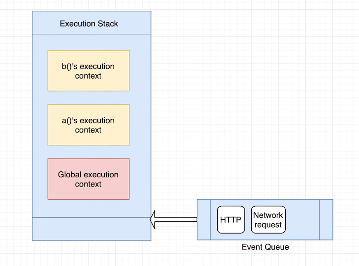

# OTUS

## ReactJS

<!--v-->

### Меня хорошо слышно и видно?


### Не забыл включить запись?

<!--v-->

### React hooks

<!--v-->

### О вебинаре

- Hooks => State + Lifecycle
- Обзор React Fiber

<!--v-->

### Ссылки про hooks

1. https://reactjs.org/docs/hooks-intro.html
2. https://medium.com/swlh/built-in-react-hooks-uselayouteffect-and-usedebugvalue-d10efe24d8de
3. https://medium.com/geographit/accessing-react-state-in-event-listeners-with-usestate-and-useref-hooks-8cceee73c559
4. https://medium.com/the-guild/under-the-hood-of-reacts-hooks-system-eb59638c9dba
5. https://www.youtube.com/watch?v=dpw9EHDh2bM

<!--v-->

### React Hooks

1. Только в функциональных компонентах
2. Нельзя в классовых компонентах
3. React полагается на порядок определения - только верхнеуровневое объявление
4. Все начинаются с префикса ‘use’
5. [eslint-plugin-react-hooks](https://www.npmjs.com/package/eslint-plugin-react-hooks)

<!--v-->

### State

<!--v-->

**useState**

1. Может быть любое количество
2. “array destructuring”
3. Обычно каждый стэйт - минимальная ячейка, независимая от других.
4. Перерисовка только когда state изменился (shallowCompare)

&darr;&darr;&darr;

<!--v-->

```ts
import React, { FC, useState } from "react";

interface PersonState {
  name: string;
  num: number;
}

export const SmartFunction: FC<{}> = () => {
  const [person, setPerson] = useState<PersonState>({name: "John", num: 3});

  return (
    <div>
      <button
        onClick={() => {
          setPerson({
            name: "Phil",
            num: 0,
          });
        }}
      />
      <p>{person.toString()}</p>
    </div>
  )
}
```

<!--v-->

**useState**

```js
export const StateComponent = () => {
  const [name, setName] = useState("");
  console.warn("re-render");
  return (
    <div>
      <button onClick={() => setName("")}>
        State Component with string Click!
      </button>
    </div>
  )
}

export const StateComponentWithObj = () => {
  const [name, setName] = useState({name: ""});
  console.warn("re-render");
  return (
    <div>
      <button onClick={() => setName({ name: ""})}>
        State Component with obj Click!!
      </button>
    </div>
  )
}
```

<!--v-->

**useEffect**

- Заменяет собой lifecycle методы
- Вызывается после каждого рендера
- Возвращаемая функция вызывается в момент изменения зависимостей, перед новым выполнение  эффекта. 
- Используется для:
  - Подписки на события
  - I/O вызовы
  - Сторонние вызовы, запуск анимации…

&darr;&darr;&darr;

<!--v-->

```js
export const StateComponentWithLifeCycle = () => {
  const [name, setName] = useState("John");

  useEffect(() => {
    console.warn("didMount+didUpdate");
    return () => {
      console.warn("willUnmount");
    };
  }, [name]);

  console.warn("re-render StateComponentWithLifeCycle");
  
  return (
    <div>
      <button onClick={() => setName("Ivan")}>
        State Component with string Click!
      </button>
    </div>
  );
};
```

<!--v-->

**useEffect**

- Render
- Проверка - изменился ли какой-либо элемент из списка зависимостей
- Нет - ничего не делать
- Да 
  - Вызвать effect callback
  - Вызвать callback return

<!--v-->

**useEffect**

1. Вызов setState в useEffect(() => {*тут*, []) - Будет вызывать отдельную пере-рисовку! Если нужно - можно использовать useLayoutEffect о котором позднее
2. Функция всегда синхронная. Если нужно асинхронное то:

```js
useEffect(() => {
  const asyncFunction = async () => {
    const result = await api.call();
    // process result
  }

  asyncFunction();
});
```

<!--v-->

**useEffect**

```js
useEffect(() => {
  const listener = (ev) => {};
  window.addEventlistener("focus", listener);
  return () => {
    window.removeEventListener("focus", listener);
  }
})
```

<!--v-->

## Вопросы?

<!--s-->

**useContext**

1. Для использования контекста (легко несколько в одном компоненте)
2. [Context](https://reactjs.org/docs/context.html) - способ передать “пропсы” минуя несколько слоёв. Обычно для глобальных свойств
3. Популярно использовать для задания темы приложения. [пример](https://reactjs.org/docs/hooks-reference.html#usecontext)

&darr;&darr;&darr;

<!--v-->

```js
// some another file
const DeepInnerComponent = () => {
  const { name } = React.useContext(SettingsContext);
  return <h3>{name}</h3>
};
// app.tsx
// defaultValue используется только когда не установили Provider
const appName = "MyAppName";
const SettingsContext = React.createContext({
  name: appName
});

export default function App() {
  const [name, setName] = React.useState(appName);
  return (
    <SettingsContext.Provider value={{ name }}>
      <div className="App">
        <h1>Hello CodeSandbox</h1>
        <h2>Start editing to see magic happen!</h2>
        <input onChange={(ev) => setName(ev.currentTarget.value)} value={name} />
        <DeepInnerComponent />
      </div>
    </SettingsContext.Provider>
  )
}
```

<!--v-->

**useReducer**

1. *const [state, dispatch] = useReducer(reducer, initValue, initFunction)*
2. *reducer = (prevState, action) => newState*
3. Вместо прямого задания нового state, вызывается dispatch. Всё что передано в dispatch -> action в reducer. 
4. Для инициализации может принимать третьим аргументов функцию, который преобразует initValue

<!--v-->

**useCallback**

Где (если есть) проблема? 

```js
export const StateComponent: FC<{}> = () => {
  const [name, setName] = useState("John");

  return (
    <div>
      <button onClick={() => setName("Phil")}>
        click in state component
      </button>
    </div>
  )
}
```

<!--v-->

**useCallback**

```js
const [name, setName] = useState("John");

const onChange = useCallback(() => setName("Phil"), []);

return (
  <div>
    <button onClick={onChange}>
      click in state component
    </button>
  </div>
)
```
1. Позволяет запоминать созданную функцию, во избежания пере-создание 
2. Массив зависимостей - при изменении каких свойств пере-создавать функцию. 
3. Пустой массив - создается один раз и **до** unmount

<!--v-->

**useCallback**

Что выведется после 2х нажатий на кнопку?

```js
const [name, setName] = useState("John");

const onChange = useCallback(() => setName(`${name} - Phil`), []);

return (
  <div>
    <button onClick={onChange}>
      {name}
    </button>
  </div>
)
```

<!--v-->

**useCallback**

Что выведется после 2х нажатий на кнопку?

```js
const [name, setName] = useState("John");

const onChange = useCallback(() => setName(`${name} - Phil`), [name]);

return (
  <div>
    <button onClick={onChange}>
      {name}
    </button>
  </div>
)
```

<!--v-->

**useCallback**

Что выведется после 2х нажатий на кнопку?

```js
const [name, setName] = useState("John");

const onChange = useCallback(() => setName(`${name} - Phil`), []);

return (
  <div>
    <button onClick={onChange}>
      {name}
    </button>
  </div>
)
```
&rarr; <span style="color: Crimson">John - Phil</span>

<!--v-->

**useCallback**

Что выведется после 2х нажатий на кнопку?

```js
const [name, setName] = useState("John");

const onChange = useCallback(() => setName(`${name} - Phil`), [name]);

return (
  <div>
    <button onClick={onChange}>
      {name}
    </button>
  </div>
)
```
&rarr; <span style="color: Crimson">John - Phil - Phil</span>

<!--v-->

**useMemo**

1. Почти то же самое, что и useCallback, только запоминается не функция я её возвращаемое значение
2. Используется если нужно произвести какие-либо “тяжёлые” вычисления

```js
const memoizedValue = useMemo(() => computeExpensiveValue(a, b), [a, b]);
```

<!--v-->

**useRef**

1. Создает “коробку” которая держит указатель на объект.
2. Этот указатель доступен через .current
3. Наиболее распространенный вариант использования - создание указателя на элемент (пример из документации)
Эквивалент React.createRef
4. Но можно размещать любой объект, на изменение которого не требуется запускать перерисовку
5. [Пример](https://codesandbox.io/s/react-hooks-c3jf4?file=/src/RefComponent.tsx)

&darr;&darr;&darr;

<!--v-->

```js
function TextInputWithFocusButon() {
  const inputEl = useRef(null);
  const onButtonClick = () => {
    // 'current' points to the mounted text input element
    inputEl.current.focus();
  };
  return (
    <>
      <input ref={inputEl} type="text" />
      <button onClick={onButtonClick}>Focus the input</button>
    </>
  );
}
```

<!--v-->

**useLayoutEffect**

1. То же самое что и useEffect
2. Но, позволяет производить изменения Синхронно 
3. Блокирует визуальные обновления

<!--v-->

**useDebugValue**

1. Добавляет некое строковое значение пользовательским Hooks, которое будет отображаться в react-devtools
2. Вторым аргументов (опционально) передается функция трансформации из объекта в строку. Вызов произойдет когда hook инспектируется

```js
const useCustomhook = () => {
  const [state, setState] = useState("name");
  useDebugValue(
    `custom hook, ${state}`,
    str => `${str}, ${new Date().toDateString()}`
  );
  return [state, setState];
};
```

<!--v-->

### Тестирование [ref](https://kentcdodds.com/blog/how-to-test-custom-react-hooks)

1. Основной акцент на custom hooks, т.к. Из всех функциональных компонент можно сделать “презентационные”, с той лишь разницей что они зависят не от props а от возвращаемого значения от хука. 
2. [@testing-library/react-hooks](https://github.com/testing-library/react-hooks-testing-library)
3. **renderHook** - имитация использования хука внутри компонента. Возвращает функции, позволяющие контролировать жизненный цикл и считывать результат 
```js
const { result } = renderHook(() => useAppState());
expect(result.current).toBe(true);
```
4. **act** - для выполнения любых действий

<!--v-->

**useCustomHooks**

1. Функция, к которой применяются те же правила, что и к встроенным в React. **Какие?**

<!--v-->

**useCustomHooks**

1. Функция, к которой применяются те же правила, что и к встроенным в React. **Какие?**
  - Начинается с префикса **use**
  - Используется только в пользовательских  hook функциях или функциональных компонентах
  - Вызов всегда происходит на верхнем уровне, без условий, циклов и т.п.
2. Пример в проекте. Функция которая отслеживает состояние фокуса на окне. 


<!--v-->

### React Fiber

1. Материал ***
2. Представленная в 16 версии React новый подход к работе с virtualDOM
3. [Habr](https://habr.com/ru/post/444276/)
4. [youtube](https://youtu.be/ZCuYPiUIONs)
5. [dive deeper](https://blog.logrocket.com/deep-dive-into-react-fiber-internals/)

<!--v-->

### Stack & event queue



<!--v-->

### React Fiber

1. Стандарт плавности - 60fps = 16ms на отрисовку следующего frame
2. **Reconciliation** - создание нового дерева, сравнение с предыдущим и определение требуемых обновлений может занять гораздо больше времени
3. **Fiber** - подход в реализации React reconсilation который позволяет приостанавливать и сохранять текущий stack-call, и проверять event queue
4. Ставит в приоритет запросы по анимации
5. Тяжёлые вычисления стали прерываемыми, не блокирую UI


<!--v-->

**requestAnimationFrame VS requestIdleCallback vs setTimeout**

```js
for (let i = 0; i < 1000; i++) {
  requestIdleCallback(() => console.log("idle"));
  requestAnimationFrame(() => console.log("animation"));
  setTimeout(() => console.log("timeout"), 0);
}
```

(1000) animate  
(1000) timeout  
(1000) idle

<!--v-->

## Вопросы?

<!--v-->

### Спасибо за внимание!
