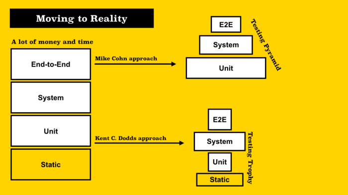
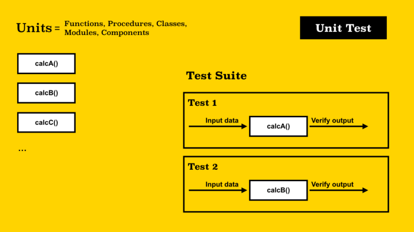

# OTUS

## ReactJS

<!-- v -->

### Меня хорошо слышно и видно?


### Не забыл включить запись?

<!-- v -->

### Вопросы?

<!-- s -->

### TST — Total System Testing

<!-- v -->

### Как не сломать приложение после каждого исправления?

> После каждого исправления ошибки нужно прогнать весь набор контрольных примеров, по которым система проверялась раньше

Ф. Брукс, Мифический человеко-месяц 1975

Англоязычный журнал PC World поместил книгу Брукса на первое место в списке «Десять IT-книг, которые стыдно признать, что не читал»

<!-- v -->
### Тотальное тестирование системы (TST — Total System Testing)

Нет ненужных тестов. Многие, повторюсь, очень многие разработчики говорят, что у них нет времени на те или иные тесты.
Представьте себе доктора, который не сделав и изучив должным образом анализы, выписал вам кучу лекарств и рекомендовал вам принимать их каждый день. Или вы купили автомобиль, который не прошел все необходимые проверки перед эксплуатацией. Или вам надо садиться и лететь на самолете, который должным образом, согласно всем инструкциям, не был протестирован перед полетом.
Так себе ситуация, неправда ли?

<!-- v -->

### Тотальное тестирование системы (TST — Total System Testing)


<!-- v -->

### Total System Testing



<!-- v -->

### Unit testing



<!-- v -->

### Mock object


<!-- v -->

### Вопросы?

<!-- s -->

### Unit testing

Модульный тест применяется для тестирования одной логически выделенной и изолированной единицы системы. Чаще всего это метод класса или простая функция (хотя я допускаю и весь класс). Изолированность тестируемой единицы достигается при помощи Заглушек (Stubs, Dummies) и Макетов (Mockups)

<!-- v -->

### Примеры

<!-- v -->

### Вопросы?

<!-- s -->

### Какие инструменты помогают писать код

* Typescript проверяет ваш код на соответствие типов
* Eslint помогает исправить проблемы в форматировании кода
* Jest библиотека для тестирования

<!-- v -->

### Jest

> Jest is a delightful JavaScript Testing Framework with a focus on simplicity. It works with projects using: Babel, TypeScript, Node, React, Angular, Vue and more!

[jest](https://jestjs.io/)

<!-- v -->

### Getting Started

```js
function sum(a, b) {
  return a + b;
}
module.exports = sum;
```

`npm install --save-dev jest`

<!-- v -->

### Jest test case

```js
const sum = require('./sum');

test('adds 1 + 2 to equal 3', () => {
  expect(sum(1, 2)).toBe(3);
});
```

#### Result

```
PASS  ./sum.test.js
✓ adds 1 + 2 to equal 3 (5ms)
```

<!-- v -->

```json
{
  "scripts": {
    "test": "jest"
  }
}
```

<!-- v -->

### Изучаем доки

[Matchers](https://jestjs.io/docs/using-matchers)

[Asynchronous](https://jestjs.io/docs/asynchronous)

[Setup-teardown](https://jestjs.io/docs/setup-teardown)

[Mock-functions](https://jestjs.io/docs/mock-functions)

<!-- v -->

### Вопросы?

<!-- s -->

### Что такое TDD and TDD

* TLD (Test Last Development) включает тестирование после реализации функционала.

В BDD к тестам на любом этапе может подключиться любой член команды, например, аналитик, бизнес пользователь, разработчик и тестировщик, так как тесты понятны всем участникам процесса.
BDD еще полезен тем, что не нужно тратить много времени на написание разного рода документации. 

<!-- v -->

### Общие рекомендации

* Придерживайтесь бережливого тестирования
* Делайте тестовый код максимально простым, коротким, свободным от абстракций, единым, замечательным в работе и бережливым. 
* Другой человек должен посмотреть на тест и сразу понять, что он делает.

<!-- v -->

### Правила написания тестов

* Что именно тестируется?
* При каких условиях и сценарии?
* Какой ожидается результат?

<!-- v -->

### Правила написания тестов

```js
describe("User login", () => {
 describe("Login success", () => {
   it("With correct username and password", () => {
```

<!-- v -->

### Не стоит генерировать и поддерживать данные с бека

[Pollyjs](https://github.com/Netflix/pollyjs)

<!-- v -->

### Генерируйте реалистичные данные

faker.js - generate massive amounts of fake data in the browser and node.js

[Faker](https://www.npmjs.com/package/faker)

<!-- v -->

### Fast-check не стоит проверять только удобные свойства

[Fast-check](https://github.com/dubzzz/fast-check#readme)

<!-- v -->

### Группируйте тесты

[testnamepatternregex](https://jestjs.io/docs/en/cli.html#--testnamepatternregex)

<!-- v -->

### Тестирование ошибок

```js
it("When no product name, it throws error 400", async () => {
 let errorWeExceptFor = null;
 try {
   const result = await addNewProduct({ name: 'nest' });
 }
 catch (error) {
   expect(error.code).to.equal('InvalidInput');
   errorWeExceptFor = error;
 }
 expect(errorWeExceptFor).not.to.be.null;
 //if this assertion fails, the tests results/reports will only show
 //that some value is null, there won't be a word about a missing Exception
});
```

<!-- v -->

### Тестирование ошибок

```js
it.only("When no product name, it throws error 400", async () => {
 expect(addNewProduct)).to.eventually.throw(AppError).with.property('code', "InvalidInput");
});
```

<!-- v -->

### Вопросы?

<!-- s -->

### Test coverage

* Очень простая оценка с помощью флага --coverage


<!-- v -->

### Изучаем репорт!

<!-- v -->

### Минимальный порог покрытия

* 85-90 % [martinfowler](https://martinfowler.com/bliki/TestCoverage.html)
* 10-80 % слишком мало для получения корректности сборки
* 100 % идельное покрытие

<!-- v -->

### Анализируйте отчеты о покрытии

* может помочь выявить недосягаемые участки кода
* Необычное поведение 
* Если вы не знаете, какие части кода остались не протестированными, то вы не знаете, где могут возникнуть проблемы

#### Запустим отчет!

<!-- v -->

### Пример

<!-- v -->

### Fast-check

[Property Based Testing with Fast-Check](https://github.com/dubzzz/fast-check)

```js
const fc = require('fast-check');

// Code under test
const contains = (text, pattern) => text.indexOf(pattern) >= 0;

// Properties
describe('properties', () => {
  // string text always contains itself
  it('should always contain itself', () => {
    fc.assert(fc.property(fc.string(), text => contains(text, text)));
  });
  // string a + b + c always contains b, whatever the values of a, b and c
  it('should always contain its substrings', () => {
    fc.assert(fc.property(fc.string(), fc.string(), fc.string(), (a,b,c) => {
      // Alternatively: no return statement and direct usage of expect or assert
      return contains(a+b+c, b);
    }));
  });
});
```

<!-- v -->

### Вопросы?

<!-- s -->

## Спасибо за внимание!
