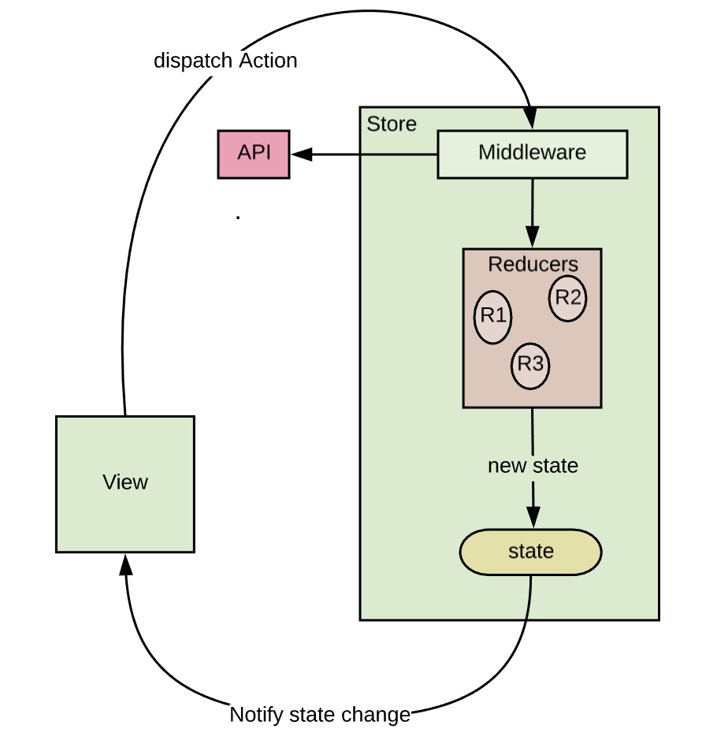

# OTUS

## ReactJS

<!-- v -->

### Меня хорошо слышно и видно?


### Не забыл включить запись?

<!-- v -->

## Вопросы?

<!-- s -->

## Redux

<!-- v -->

### Что мы уже знаем

1. **React** — библиотека для интерактивных интерфейсов
2. Компоненты могут сами себя обновлять через *state + setState*
3. Иногда компоненты вызывают лайфсайкл-хуки
4. Паттерны: *HOC, smart / dumb components, render prop*

<!-- v -->

### На вебинаре мы узнаем


<!-- v -->

## State management

<!-- v -->

#### Где мы можем хранить состояние?
- useState / Component.state
- URL
- внешний объект

<!-- v -->

#### При этом состояние может быть:
- сосредоточенно в одном месте
- распределено по дереву компонентов

<!-- v -->

###  State management

&plus;&sol;&minus;

<!-- v -->

## Вопросы?

<!-- s -->

## Redux

<!-- v -->

### Мотивация

https://rajdee.gitbooks.io/redux-in-russian/content/docs/introduction/Motivation.html

<!-- v -->

### Redux - 3 принципа

- **Единственный источник правды**  
Состояние всего вашего приложения сохранено в дереве объектов внутри одного стора.
- **Состояние только для чтения**  
Единственный способ изменить состояние — это применить экшен — объект, который описывает, что случится.
- **Мутации написаны, как чистые функции**  
Для определения того, как дерево состояния будет трансформировано экшенами, вы пишете чистые редюсеры.

https://rajdee.gitbooks.io/redux-in-russian/content/docs/introduction/ThreePrinciples.html

<!-- v -->

#### Когда имеет смысл использовать Redux?
1. У вас есть обоснованные объемы данных, меняющихся со временем
2. Вам нужен один источник информации для вашего состояния
3. Вы приходите к выводу, что сохранять все ваше состояние в компоненте верхнего уровня уже недостаточно

<!-- v -->

## Вопросы?

<!-- s -->

## Redux - Термины

<!-- v -->

### State  
Объект в котором хранятся данные приложения

<!-- v -->

### Action

Объект, который описывает, что происходит в системе

```ts
interface Action<T = any> {
  type: T,
  payload?: any
}
```

https://rajdee.gitbooks.io/redux-in-russian/content/docs/basics/Actions.html

<!-- v -->

### Reducer

Функция (чистая), которая возвращает новый state как реакцию на action

```ts
type Reducer<S = any, A extends Action = AnyAction> = (
  state: S | undefined,
  action: A
) => S
```

https://rajdee.gitbooks.io/redux-in-russian/content/docs/basics/Reducers.html 

<!-- v -->

### Store

Oбъект, который соединяет эти части вместе:

- содержит состояние приложения (application state);
- предоставляет доступ к состоянию с помощью getState();
- предоставляет возможность обновления состояния с помощью dispatch(action);
- обрабатывает отмену регистрации слушателей с помощью функции, возвращаемой subscribe(listener).

https://rajdee.gitbooks.io/redux-in-russian/content/docs/basics/Store.html

<!-- v -->

### Redux - Поток данных


<!-- v -->

### Redux - Поток данных



<!-- v -->

## Вопросы?

<!-- s -->

## Redux - API

<!-- v -->

### Высокоуровневые экспорты

- createStore(reducer, [preloadedState], [enhancer])
- combineReducers(reducers)
- applyMiddleware(...middlewares)
- bindActionCreators(actionCreators, dispatch)
- compose(...functions)

https://rajdee.gitbooks.io/redux-in-russian/content/docs/api/

<!-- v -->

### API стора Store

- getState()
- dispatch(action)
- subscribe(listener)
- replaceReducer(nextReducer)

https://rajdee.gitbooks.io/redux-in-russian/content/docs/api/

<!-- v -->

## Вопросы?

<!-- s -->

## Redux - Reducer

<!-- v -->

#### Redux - Reducer

```ts
interface State {
  users: {
    name: string;
    score: number;
  }[];
  gameField: string[][];
}
```

<!-- v -->

#### Redux - Reducer

```ts
const defaultState: State = {
  users: [],
  gameField: [[]]
}
```

<!-- v -->

#### Redux - Reducer

```ts
function reducer(state: State = defaultState, action: Action): State {
  return state;
}
```

<!-- v -->

#### Redux - Reducer

```ts
function reducer(state: State = defaultState, action: Action): State {
  switch (action.type) {
    case 'ADD_USER': {
      return {
        ...state,
        users: [...state.users, action.payload],
      };
    }
  }

  return state;
}
```

<!-- v -->

#### Redux - Reducer

```ts
interface State {
  users: // ... <- usersReducer
  gameField: // ... <- gameFieldReducer
}
```

<!-- v -->

#### Redux - Reducer

```ts
type UsersState = {
  name: string;
  score: number;
}[];

const defaultUsersState = [];

function usersReducer(state: UsersState = defaultUsersState, action: Action): UsersState {
  switch (action.type) {
    case 'ADD_USER':
      return [...state, action.payload];  
    default:
      return state;
    }
}
```

<!-- v -->

#### Redux - Reducer

```ts
const reducer = combineReducers([
  users: usersReducer,
  gameField: gameFieldReducer,
]);
```
<!-- v -->

## Вопросы?

<!-- s -->

## Время кода

<!-- v -->

### Как можно тестировать всю эту радость?

- тестировать reducers как чистые функции (state + action in => state out)
- тестировать связку dispatch + getState (DevTools в помощь)

http://extension.remotedev.io/  
https://redux.js.org/recipes/writing-tests#reducers

<!-- v -->

## Вопросы?

<!-- s -->

### Напишите 2 самых непонятных момента из занятия

<!-- v -->

### Напишите 3 вещи, которые вы вынесли из занятия

<!-- v -->

### Домашнее задание

- Продумать структуру State для вашего приложения
- Продумать список Actions, которые нужны для вашего приложения
- Создать Store и редьюсеры (с логикой обработки actions)
- Написать свой собственный combineReducers (и покрыть его тестами)

<!-- v -->

## Спасибо за внимание!
