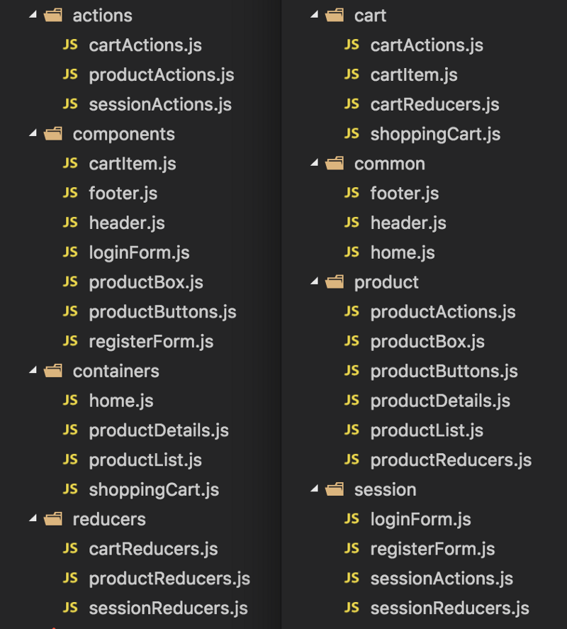

# OTUS

## ReactJS

<!-- v -->

### Меня хорошо слышно и видно?


### Не забыл включить запись?

<!-- v -->

## Вопросы?

<!-- s -->

### Что мы уже знаем?

<u>Redux и его API</u>
1. как создавать данные в Redux
2. как изменять данные в Redux
3. как дебажить Redux

<!-- v -->

## Вопросы?

<!-- s -->

### Принципы redux?

<!-- v -->

### Что такое action creator?

<!-- v -->

### Что такое reducer?

<!-- v -->

### Какие аргументы принимает connect()?
 
<!-- v -->
 
### Что такое селектор?

<!-- v -->

### Какой API у store?

<!-- v -->

### Недостатки redux?

<!-- s -->

## Redux Toolkit

https://redux.js.org/redux-toolkit/overview

<!-- v -->

### Redux Toolkit - actions

```ts
function someActionCreator1(payload: { name: string; age: number }) {
  return {
    type: "SOME_ACTION",
    payload,
  };
}

const someActionCreator2 = createAction<{ name: string; age: number}>(
  "SOME_ACTION"
);
```

https://redux-toolkit.js.org/api/createAction

<!-- v -->

```js
if (action.type === "SOME_ACTION") {
  action.payload. // nothing here
}

if (someActionCreator2.match(action)) {
  action.payload. // we know the payload
}
```

https://basarat.gitbook.io/typescript/type-system/typeguard

<!-- v -->

```js
function counter(state = 0, action) {
  switch (action.type) {
    case INCREMENT: 
      return state + 1;
    case DECREMENT:
      return state - 1;
    default:
      return state;
  }
}

const counter = createReducer(0, {
  [increment]: state => state + 1,
  [decrement]: state => state - 1
})
```

https://redux-toolkit.js.org/api/createReducer

<!-- v -->

```js
const reducer = createReducer(
  {
    totalAge: 0,
    names: "",
  },
  {
    [someActionCreator2.type]: (state, action) => ({
      totalAge: state.totalAge + action.payload.age,
      names: state.names + " " + action.payload.name,
    }),
  }
);
```

https://redux-toolkit.js.org/api/createReducer

<!-- v -->

## Вопросы?

<!-- s -->

### Redux Toolkit - Иммутабельность

```js
import produce from "immer";

const baseState = [
  {
    todo: "Learn typescript",
    done: true,
  },
  {
    todo: "Try immer",
    done: false,
  },
];

const nextState = produce(baseState, (draftState) => {
  draftState.push({ todo: "Tweet about it" });
  draftState[1].done = true;
});
```

https://github.com/immerjs/immer  
https://immerjs.github.io/immer/docs/introduction

<!-- v -->

```js
const reducer = createReducer(
  {
    totalAge: 0,
    names: "",
  },
  {
    [someActionCreator2.type]: (state, action) => {
      state.totalAge += action.payload.age;
      state.names += ", " + action.payload.name;
      return state;
    },
  }
);
```

https://redux-toolkit.js.org/api/createReducer#direct-state-mutation

<!-- v -->

## Вопросы?

<!-- s -->

## Redux Toolkit
## Slices

https://redux.js.org/redux-toolkit/overview

<!-- v -->

### Redux Toolkit - Slices

```ts
export declare interface Slice<State = any,
 CaseReducers extends SliceCaseReducers<State> = SliceCaseReducers<State>, 
 Name extends string = string> {
  /**
  * The slice name.
  */
  name: Name;
  /**
  * The slice's reducer.
  */
  reducer: Reducer<State>;
  /**
  * Action creators for the types of actions that are handled by the slice reducer.
  */
  actions: CaseReducerActions<CaseReducers>;
  /**
  * The individual cae reudcer functions that were passed in the `reducers` parameter.
  * This enables reuse and testing if they were defined inline when calling `createSlice`.
  */
  caseReducers: SliceDefinedCaseReducers<CaseReducers>;
}
```

https://redux-toolkit.js.org/api/createSlice

<!-- v -->

```js
const counterSlice = createSlice({
  name: "counter",
  initialState: 0,
  reducers: {
    increment: state => state + 1,
    decrement: state => state - 1
  }
})

const store = configureStore({
  reducer: counterSlice.reducer
})

document.getElementById("increment").addEventListener("click", () => {
  store.disptch(counterSlice.actions.increment())
})
```
https://redux-toolkit.js.org/tutorials/basic-tutorial#introducing-createslice

<!-- v -->

## Вопросы?

<!-- s -->

## Redux Toolkit
## Итоги

https://redux.js.org/redux-toolkit/overview

<!-- v -->

### Из чего состоит Redux Toolkit

1. Redux
2. Redux-Thunk
3. Immer
4. Reselect

https://github.com/reduxjs/redux-toolkit/blob/master/package.json#L60

<!-- v -->

### Redux Toolkit API

1. configureStore
2. <span style="color: LightGray">getDefaultMiddleware</span>
3. createReducer
4. createAction
5. createSlice
6. createSelector
7. <span style="color: LightGray">createAsyncThunk</span>
8. createEntityAdapter
9. Other Exports

<!-- v -->

### Redux Toolkit - configureStore

```ts
type ConfigureEnhancersCallback = (
  defaultEnhancers: StoreEnhancer[]
) => StoreEnhancer[]

interface ConfigureStoreOptions<S = any, A extends Action = AnyAction> {
  // A single reducer function that will be used as the root reducer, or an 
  // object of slice reudcers that will passed to `combineReducers()`
  reducer: Reducer<S, A> | ReducersMapObject<S, A>
  // An array of Redux middleware to install
  middleware?; Middleware<{}, S>[]
  // Whether to enable Redux DevTools integration. Defaults to `true`.
  // Additional configuration can be done by passing Redux Devtools options
  devTools?: boolean | DevToolsOptions
  // the initial state, same as Redux's createStore.
  preloadedState?: DeepPartial<S extends any ? S : S>
  // The store enhancers to apply. See Redux's `createStore()`.
  enhancers?: StoreEnhancer[] | ConfigureEnhancersCallback
}
```
https://redux-toolkit.js.org/api/configureStore

<!-- v -->

## Код

<!-- v -->

## Вопросы? 

<!-- s -->

### Достойны упоминания

<!-- v -->

### Из чего состоит Redux Toolkit

1. **Redux-actions** https://redux-actions.js.org/
2. **typesafe-actions** https://github.com/piotrwitek/typesafe-actions
3. **Rematch** https://rematch.github.io/rematch 

https://habr.com/ru/post/353554/  
https://habr.com/ru/post/491848/

<!-- v -->

## Организация проекта

<!-- v -->

### Types vs Features



<a href="https://blogru.4xxi.com/%D0%BE%D1%80%D0%B3%D0%B0%D0%BD%D0%B8%D0%B7%D0%B0%D1%86%D0%B8%D1%8F-%D0%BA%D0%BE%D0%B4%D0%B0-%D0%B2-%D0%BC%D0%B0%D1%81%D1%88%D1%82%D0%B0%D0%B1%D0%BD%D1%8B%D1%85-react-%D0%BF%D1%80%D0%BE%D0%B5%D0%BA%D1%82%D0%B0%D1%85-bc00ce1621e3">Организация кода в масштабных React проектах</a>

<!-- v -->

## Вопросы?

<!-- s -->

## Итоги

### В чем плюсы использования Redux Toolkit ?

<!-- v -->

### Какие библиотеки идут 
### в составе Redux Toolkit ?

<!-- v -->

### Дополнительные материалы

1. [Идиоматический Redux: Redux Toolkit 1.0](https://ru.hexlet.io/blog/posts/idiomaticheskiy-redux-redux-starter-kit-1-0)
3. [Redux Toolkit как средство эффективной Redux-разработки](https://habr.com/ru/company/inobitec/blog/481288/) 
3. [Redux Toolkit Tutorial](https://redux-toolkit.js.org/tutorials/basic-tutorial) ( и продолжения [раз](https://redux-toolkit.js.org/tutorials/intermediate-tutorial) и [два](https://redux-toolkit.js.org/tutorials/advanced-tutorial))
4. [Deep Dive into Redux Toolkit with React - Complete Guide](https://www.youtube.com/watch?v=9lCmbth63k0)

<!-- v -->

### Опрос

https://otus.ru/polls/17008/

<!-- v -->

## Спасибо за понимание!
