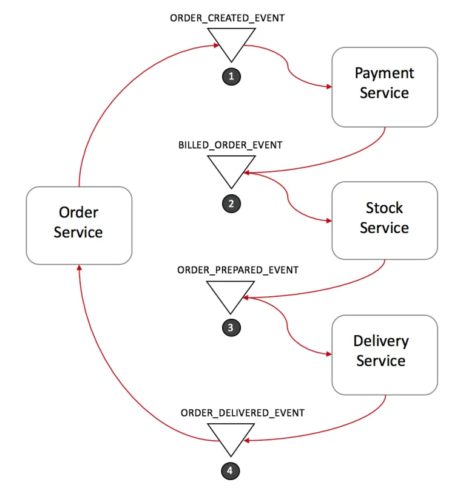
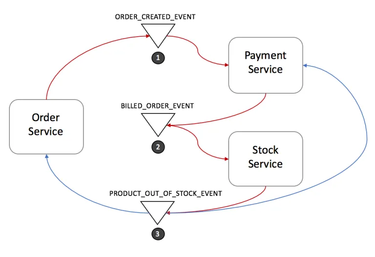

# OTUS

## ReactJS

<!--v-->

### Меня хорошо слышно и видно?


### Не забыл включить запись?

<!--v-->

### Что сегодня пройдём?

* Generators
* Iterators
* Async iterators
* The SAGA pattern

<!--v-->

### Вопросы?

<!--s-->

## Generators

<!--v-->

### Generators

* Функция, которая возвращает значения одно за другим
* Перебираемые объекты, потоки данных

<!--v-->

### Зачем вообще мне это знать?

* Концепт позволяет писать асинхронный код без async/await
* Очень легко покрывать тестами
* Redux-saga построена на генераторах

<!--v-->

### Синтаксис

```js
function* genFunc() {
 //···
}

const genFunc2 = function* () {
 //···
};
```

<!--v-->

### Синтаксис

```js
const obj = {
 *generatorMethod() {
   //···
 },
};

const genObj = obj.generatorMethod();
```

<!--v-->

### Синтаксис

```js
class MyClass {
 *generatorMethod() {
   //···
 }
}

const myInst = new MyClass();
const genObj2 = myInst.generatorMethod();
```

<!--v-->

### Первый генератор

```js
function* genFunc() {
 yield "a";
 yield "b";
}
```

<!--v-->

### Как получить данные

```js
for (const x of genFunc()) {
 console.log(x);
}
// Output:
// a
// b
```

<!--v-->

### Как получить данные

```js
const arr = [...genFunc()]; // ['a', 'b']
```

<!--v-->

### Боевой пример

```js
function* objectEntries(obj) {
 // In ES6, you can use strings or symbols as property keys,
 // Reflect.ownKeys() retrieves both
 const propKeys = Reflect.ownKeys(obj);

 for (const propKey of propKeys) {
   yield [propKey, obj[propKey]];
 }
}
```

<!--v-->

### Боевой пример

```js
const jane = { first: "Jane", last: "Doe" };
for (const [key, value] of objectEntries(jane)) {
 console.log(`${key}: ${value}`);
}

// first: Jane
// last: Doe
```

<!--v-->

### Как комбинировать генераторы

```js
function* foo() {
 yield "a";
 yield "b";
}

function* bar() {
 yield "x";
 foo(); // does nothing!
 yield "y";
}
```

<!--v-->

### Как комбинировать генераторы

```js
function* bar() {
 yield "x";
 yield* foo();
 yield "y";
}

// Collect all values yielded by bar() in an array
let arr = [...bar()];
// ['x', 'a', 'b', 'y']
```

<!--v-->

### Комбинация работает примерно так

```js
function* bar() {
 yield "x";
 for (const value of foo()) {
   yield value;
 }
 yield "y";
}
```

<!--v-->

### Даже вот так работает

```js
function* bla() {
 yield "sequence";
 yield* ["of", "yielded"]; // it can be any iterable
 yield "values";
}
```

<!--v-->

### А так не работает

```js
function* genFunc() {
 ["a", "b"].forEach((x) => yield x); // SyntaxError
}

function* genFunc() {
 for (const x of ["a", "b"]) {
   yield x; // OK
 }
}
```

<!--v-->

### Flow

```js
function* genFunc2() {
 try {
   console.log("Started");
   yield;
 } finally {
   yield "Not done, yet!";
 }
}

genObj2.next()
> Started
// { value: undefined, done: false }

genObj2.return('Result')
// { value: 'Not done, yet!', done: false }
genObj2.next()
// { value: 'Result', done: true }
```

<!--v-->

### throw

```js
function* genFunc1() {
 try {
   console.log("Started");
   yield; // (A)
 } catch (error) {
   console.log("Caught: " + error);
 }
}

const genObj1 = genFunc1();

genObj1.next();
// > Started
// { value: undefined, done: false }

genObj1.throw(new Error("Problem!"));
// Caught: Error: Problem!
// { value: undefined, done: true }
```

<!--v-->

## Практика

<!--v-->

## Вопросы

<!--s-->

## Iterators

<!--v-->

### Создание простого итератора

```js
export const createSimpleIterator = (from: number, to: number) => ({
 from,
 to,
 [Symbol.iterator]: () => ({
   next: () => {
     return from <= to ? { done: false, value: from++ } : { done: true };
   },
 }),
});
```

<!--v-->

### Как с этим работать

```js
const simpleIterator = createSimpleIterator(1, 5);
for (const value of simpleIterator) {
  // value of iterator ...
```

<!--v-->

### Зачем вообще мне это знать?

* Вы уже работаете с итераторами объекты string, arrays устроены так по умолчанию
* Можно создавать асинхронные итераторы

<!--v-->

## Практика

<!--s-->

## Асинхронный код с генераторами

<!--v-->

### Зачем вообще мне это знать?

[Callback Hell](http://callbackhell.com/)

<!--v-->

```js
fs.readdir(source, function (err, files) {
  if (err) {
    console.log('Error finding files: ' + err)
  } else {
    files.forEach(function (filename, fileIndex) {
      console.log(filename)
      gm(source + filename).size(function (err, values) {
        if (err) {
          console.log('Error identifying file size: ' + err)
        } else {
          console.log(filename + ' : ' + values)
          aspect = (values.width / values.height)
          widths.forEach(function (width, widthIndex) {
            height = Math.round(width / aspect)
            console.log('resizing ' + filename + 'to ' + height + 'x' + height)
            this.resize(width, height).write(dest + 'w' + width + '_' + filename, function(err) {
              if (err) console.log('Error writing file: ' + err)
            })
          }.bind(this))
        }
      })
    })
  }
})
```

<!--v-->

### Зачем вообще мне это знать?

[Pyramid of doom](https://en.wikipedia.org/wiki/Pyramid_of_doom_(programming))

```js
// Example 1
theWidth = windows("Main").views(5).size().width();

// Example 2
if !windows.contains("Main") {
    // handle error
} else if !windows("Main").views.contains(5) {
    // handle error
} else {
    theWidth = windows("Main").views(5).size().width();
    //more code that works with theWidth
}

```

<!--v-->

### Как генераторы помогут исправить это?

```js
const val1 = yield fetchSomething();
const val2 = yield fetchSomething();
const val3 = yield fetchSomething();

return [val1, val2, val3];

```

<!--v-->

### Где посмотреть на решение получше

[lib co](https://github.com/tj/co)

<!--v-->

## Практика

<!--s-->

## Redux-saga

<!--v-->

### The SAGA Pattern

* One of the most well-known patterns for distributed transactions is called Saga. The first paper about it was published back in 1987 and has it been a popular solution since then.
* [Saga part1](https://blog.couchbase.com/saga-pattern-implement-business-transactions-using-microservices-part/)
* [Saga part2](https://blog.couchbase.com/saga-pattern-implement-business-transactions-using-microservices-part-2/)

<!--v-->



<!--v-->



<!--v-->

### Что такое side-effect?

[side effect](https://en.wikipedia.org/wiki/Side_effect_(computer_science)
)

> In computer science, an operation, function or expression is said to have a side effect if it modifies some state variable value(s) outside its local environment...

<!--v-->

### Redux-Saga

> [redux-saga](https://redux-saga.js.org/) is a library that aims to make application side effects (i.e. asynchronous things like data fetching and impure things like accessing the browser cache) easier to manage, more efficient to execute, easy to test, and better at handling failures.

[с чего начать](https://redux-saga.js.org/docs/ExternalResources.html)

<!--v-->

## Практика

<!--v-->

## Спасибо за внимание!
