# OTUS

## ReactJS

<!--v-->

### Меня хорошо слышно и видно?

### Не забыл включить запись?

<!--v-->

## App testing 

<!--v-->

### Как не сломать приложение после каждого исправления?

  “После каждого исправления ошибки нужно прогнать весь набор контрольных примеров, по которым система проверялась раньше”    
  Ф. Брукс, Мифический человеко-месяц 1975 

  Англоязычный журнал PC World поместил книгу Брукса на первое место в списке «Десять IT-книг, которые стыдно признать, что не читал»

<!--v-->

### Тотальное тестирование системы (TST — Total System Testing)

  Нет ненужных тестов. Многие, повторюсь, очень многие разработчики говорят, что у них нет времени на те или иные тесты. Представьте себе доктора, который не сделав и изучив должным образом анализы, выписал вам кучу лекарств и рекомендовал вам принимать их каждый день. Или вы купили автомобиль, который не прошел все необходимые проверки перед эксплуатацией. Или вам надо садиться и лететь на самолете, который должным образом, согласно всем инструкциям, не был протестирован перед полетом. Так себе ситуация, неправда ли?

<!--v-->

### Тотальное тестирование системы (TST — Total System Testing)

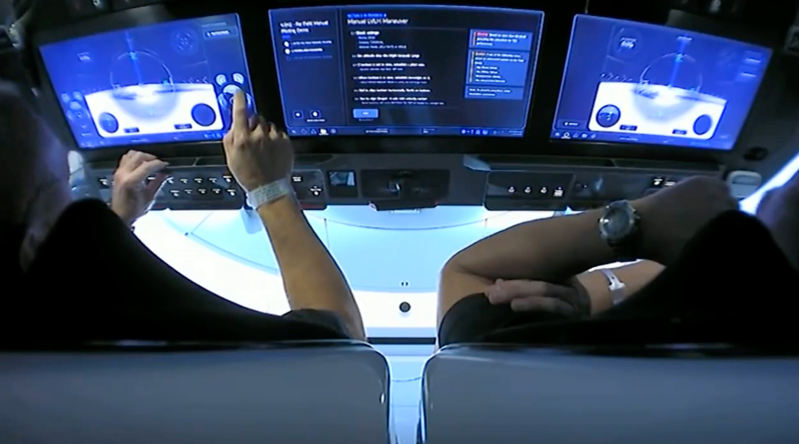

https://iss-sim.spacex.com/

<!--v-->

### Total System Testing

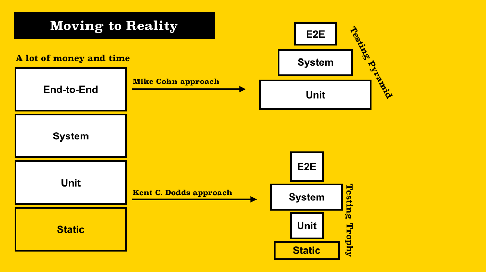

<!--v-->

### Unit test, Block test, Component test

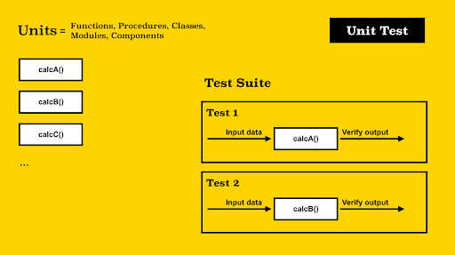

<!--v-->

### Mock object example

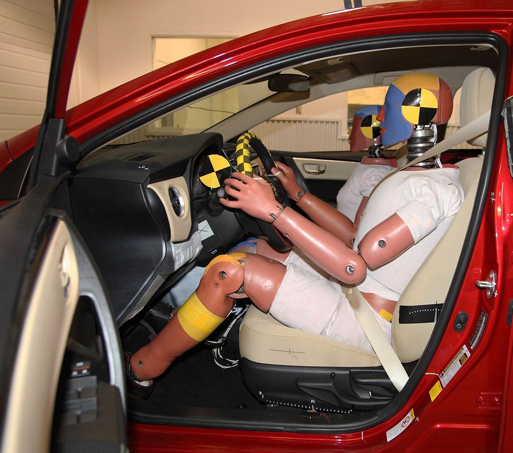

<!--v-->

### Это правило поможет вам развиваться

  “Мое практическое правило: 1/3 времени — на проектирование, 1/6 — на написание программы, 1/4 — на тестирование компонентов и 1/4 — на <b>системное тестирование.</b>”
      
  Ф. Брукс, Мифический человеко-месяц 1975 

  Англоязычный журнал PC World поместил книгу Брукса на первое место в списке «Десять IT-книг, которые стыдно признать, что не читал»

<!--v-->

### Системный тест (System test, Service test)

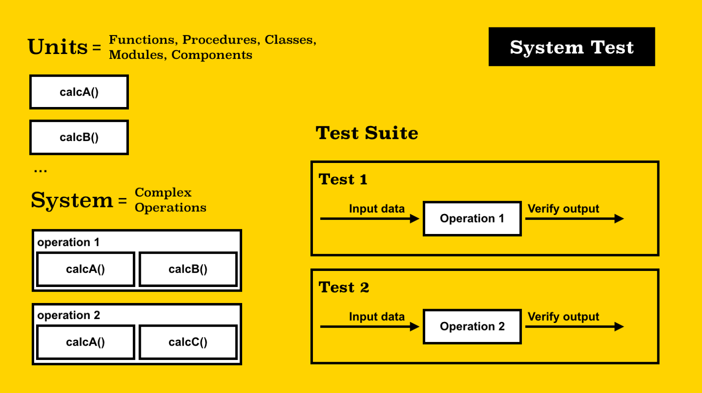

<!--v-->

### Integration test, Contract test, API driven test

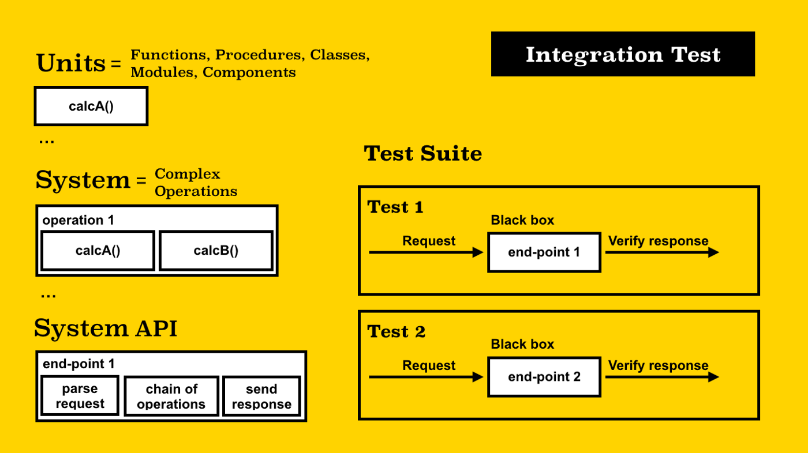

<!--v-->

### Полезная библиотека

https://github.com/Netflix/pollyjs

<!--v-->

### Functional or End-to-End test, GUI test, Walk-Through test

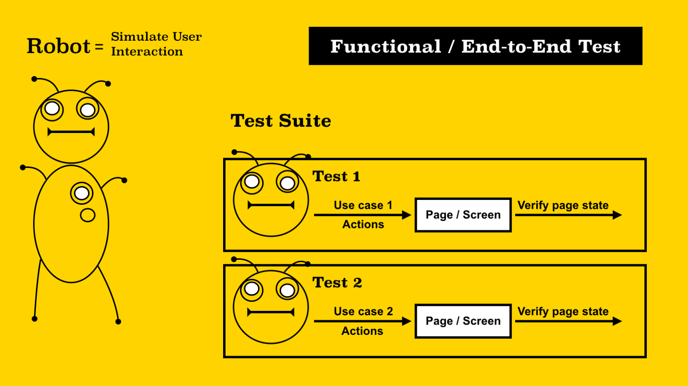

<!--v-->

### Полезная библиотека

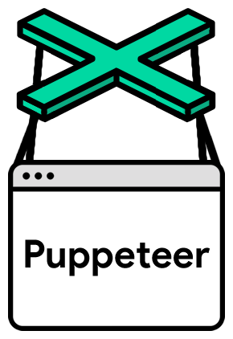

https://github.com/puppeteer/puppeteer/

<!--v-->

### Snapshot test

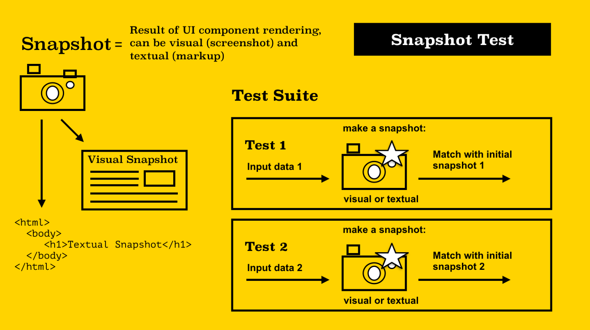

<!--v-->

### Полезная библиотека

https://loki.js.org/getting-started.html

<!--v-->

### Smoke test

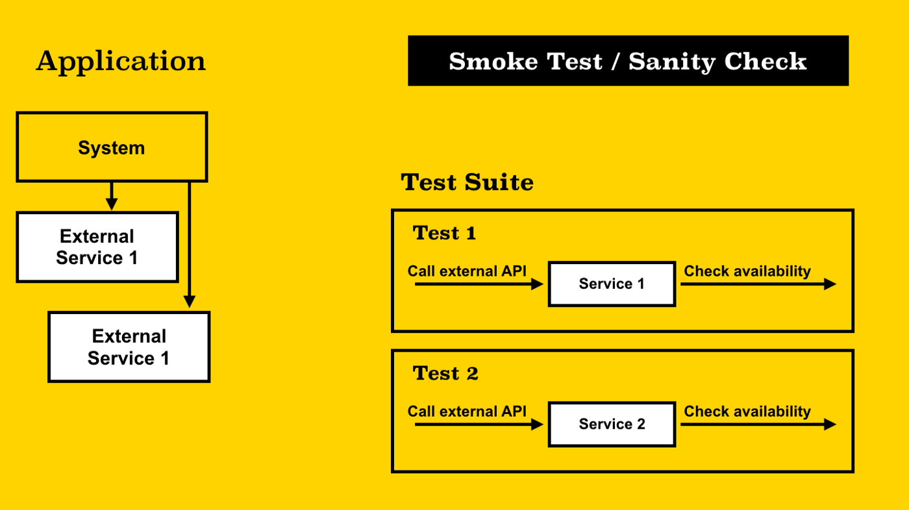

<!--v-->

### Немного истории

  Дымовое тестирование — пришло из сферы проверки оборудования, если, после подачи питания, появляется дым и запах гари, то оборудование неисправно.
      
  Философия DevOps. Искусство управления IT, 2017 

<!--v-->

### Regression test

<!--v-->

### Acceptance test, Story test

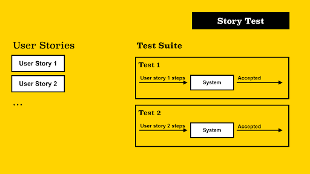

<!--v-->

### Penetration test

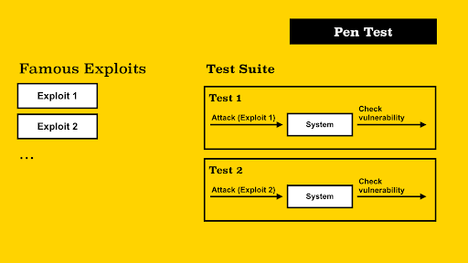

<!--v-->

### Fuzzing test, Fuzztest, Random test

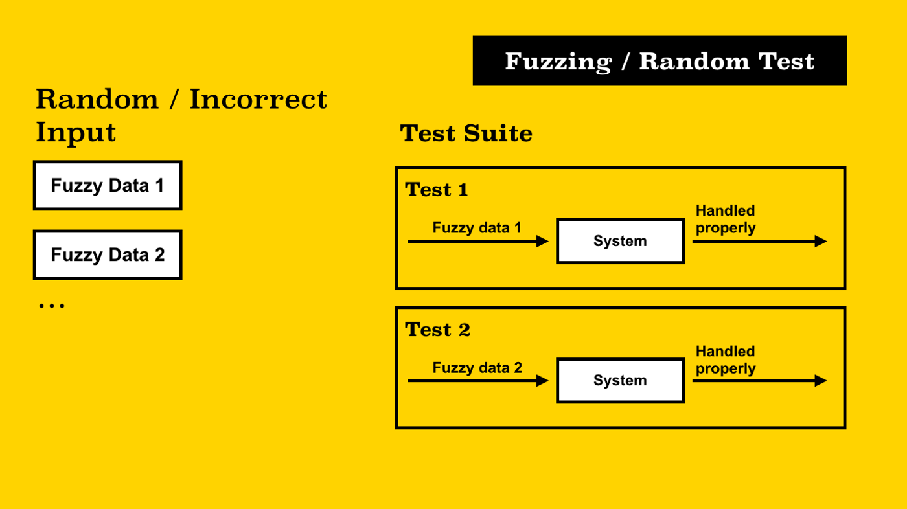

<!--v-->

## Вопросы?

<!--v-->

## Практика

<!--v-->

## Спасибо за внимание!
